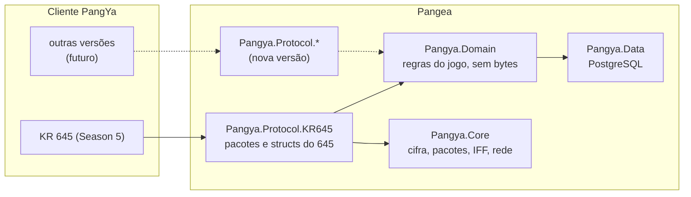

<div align="center">

# Pangea

**Servidor de PangYa em C#, construído a partir do próprio cliente.**

Começa pelo cliente coreano **KR 645 (Season 5)** e foi desenhado em camadas para receber outras versões:
como a Pangeia, um único continente que une todos.


</div>

---

## Sobre

O Pangea é uma reimplementação dos servidores de PangYa (login, game, mensageiro, ranking e web) escrita do zero
em C#. Cada pacote foi estudado no cliente real (decompilação do executável 645, reconstrução do
[rebang](https://github.com/pangbox/rebang) e comparação com servidores de referência) e documentado antes de
virar código: a pasta [`docs/protocolo`](docs/protocolo) tem mais de 35 especificações, com cada fato marcado
como confirmado no cliente, só na referência ou inferido.

Princípios do projeto:

- **O servidor nunca confia no cliente.** Compras, equipamento, recompensas e estatísticas são conferidos e
  limitados no servidor.
- **A lógica do jogo não conhece a versão do cliente.** Bytes e pacotes ficam numa camada por versão
  (`Pangya.Protocol.KR645`); regras, contas e partidas ficam no domínio, que serve a qualquer versão.
- **Toda funcionalidade tem teste**, de unidade e de protocolo, com um cliente falso que decodifica os pacotes
  como o cliente real.

## O que já funciona

| Área | Destaques |
|---|---|
| **Contas e login** | Cadastro web, login do cliente (HTTP + login server), nickname e personagem, lista de servidores, canais e lobby |
| **Partidas** | Stroke, dupla, match, pang battle, torneio (até 30 jogadores), approach, GuildMatch e Wiz City; tela de resultado com EXP, troféus e medalhas; recordes por curso |
| **Bot** | Joga como o oponente do próprio cliente: mira, força e vento; power shot, Tomahawk, Spike e Cobra; itens de partida; memória de água/OB por buraco e calibração por taco, **gravadas no banco e aprendidas a cada partida**; cinco níveis, de fácil a impossível |
| **Treasure Hunter** | Pontos por buraco, caixas de prêmio no fim e entrega direto no inventário |
| **Loja e itens** | Loja (pang e cookie), equipamento, upgrades, cards, mascotes, caddies, anéis, Papel Shop, raspadinha, Caixa Mágica, Spin Cube, aluguel |
| **Self Design** | Roupas desenhadas pelo jogador: chave de envio, upload e download HTTP, cópia do desenho |
| **Lounge** | Avatares, emotes, loja pessoal entre jogadores e itens especiais (gigante, cabeça grande, brilho...) |
| **Social** | Correio com anexos, mensageiro (amigos, conversa, status), sussurro, convites, bilhetes |
| **Guildas** | Criação, cargos, pedidos, emblema por upload, chat de guilda e GuildMatch com placar e histórico |
| **Ranking** | Geral, por curso e recordes, com classes de nível e retrato diário |
| **Administração** | Comandos de GM no jogo, painel web protegido (IP, conta GM, CSRF) e auditoria de toda ação |

O mapa completo, com o que falta, está em [`docs/ESTADO.md`](docs/ESTADO.md).

## Arquitetura



| Projeto | Papel |
|---|---|
| `Pangya.Core` | Cifra dos pacotes, leitura/escrita, IFF, configuração, logs e limites de conexão |
| `Pangya.Domain` | Contas, jogadores, itens, salas, partidas, bot, guildas, correio, ranking — **independente da versão** |
| `Pangya.Protocol.KR645` | Tudo o que é do cliente 645: ids de pacote, structs (geradas a partir do cliente) e dados do `pangya.iff` |
| `Pangya.Data` | Repositórios PostgreSQL e migrações (`Migrations/NNN_nome.sql`) |
| `Pangya.Login` · `Pangya.Game` · `Pangya.Messenger` · `Pangya.Ranking` · `Pangya.Web` | Os servidores |
| `Pangya.Server` | Executável único: sobe os servidores escolhidos e traz os comandos de administração |

Para acrescentar uma versão do cliente, cria-se outra camada `Pangya.Protocol.*` sobre o mesmo domínio e o mesmo banco.

## Começando

> **Primeira vez?** Siga o tutorial [**Começando: do zero até a primeira partida**](docs/COMECANDO.md): instalar,
> preparar o banco, gerar o cliente apontado para o servidor e jogar contra o bot.

Resumo para quem já tem **.NET 10 SDK** e **PostgreSQL** (o ambiente de desenvolvimento é o WSL/Ubuntu):

```bash
# prepara o PostgreSQL, os bancos e gera config/pangya.json e config/test.json (senha aleatória)
bash tools/setup-dev.sh

# compila e roda todos os testes; termina com "VERIFY: VERDE"
bash verify.sh

# sobe os servidores em segundo plano (log em logs/server.out)
bash tools/start.sh
```

Portas padrão (configuráveis em `config/pangya.json`):

| Servidor | Porta |
|---|---|
| Web (login HTTP, cadastro, uploads, painel `/admin`) | 30080 |
| Login | 30101 |
| Game | 30201 |
| Mensageiro | 30303 |
| Ranking | 30474 |

O cliente precisa apontar para o servidor: [`tools/client/make_client.py`](tools/client/make_client.py) gera uma
**cópia nova** do executável com o IP, as portas e as URLs trocadas, sem alterar o original.

### Administração pela linha de comando

```bash
dotnet src/Pangya.Server/bin/Release/net10.0/Pangya.Server.dll --config config/pangya.json <comando>
```

| Comando | O que faz |
|---|---|
| `account-create <login> <senha> <nick>` | Conta pronta para jogar |
| `account-password <login> <senha>` | Troca a senha |
| `player-set <login> pang= cookie= level= identity=` | Ajusta um jogador (`identity=0x14` = GM) |
| `item-give <login> <typeid> [qtd] [dias]` | Entrega um item |
| `give-all <login>` · `give-parts <login>` | Tudo do jogo, sem roupas · todas as roupas e anéis |

Toda ação de administração fica registrada na auditoria (`audit_log`).

## Documentação

| Documento | Conteúdo |
|---|---|
| [`docs/COMECANDO.md`](docs/COMECANDO.md) | Tutorial passo a passo: instalação, banco, cliente e primeira partida |
| [`docs/PLANO.md`](docs/PLANO.md) | Objetivo, regras do código, fases e decisões |
| [`docs/ESTADO.md`](docs/ESTADO.md) | O que funciona, o que falta e como testar |
| [`docs/protocolo/`](docs/protocolo) | Especificações por sistema: login, sala, partida, física, bot, loja, guilda, torneio, Treasure Hunter, Self Design... |

## Créditos

- [**rebang**](https://github.com/pangbox/rebang) — reconstrução do código do cliente, base de boa parte da pesquisa.
- Servidores de referência da comunidade, usados para comparar fluxos e ordens de pacotes.
- PangYa é marca de seus respectivos donos. Este é um projeto de fãs, sem fins comerciais e sem vínculo com os
  detentores do jogo; nenhum arquivo do jogo faz parte deste repositório.

## Licença

[AGPL-3.0](LICENSE): livre para usar, estudar e modificar. Quem rodar uma versão modificada como servidor para outras
pessoas tem de publicar o código dessas mudanças, para que as melhorias voltem para a comunidade.
